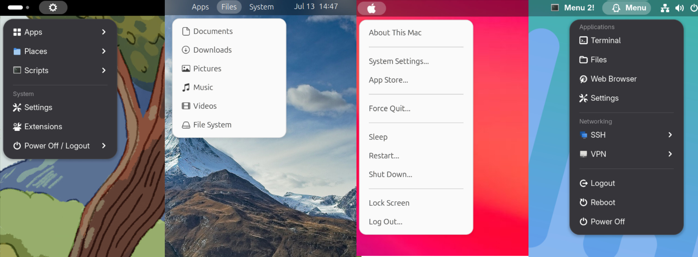
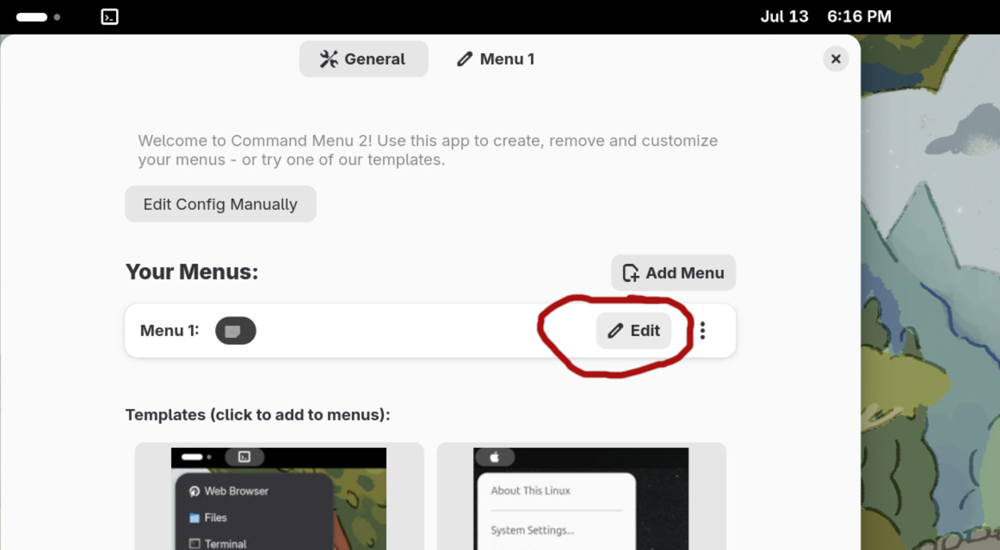
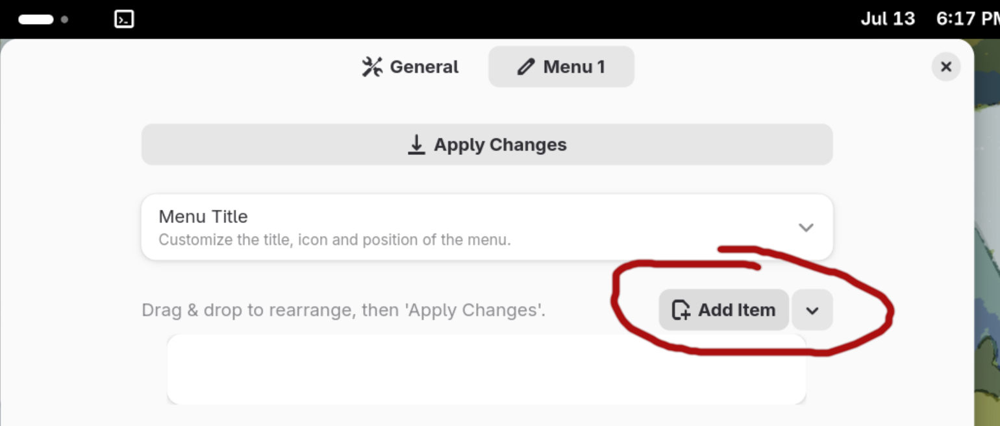
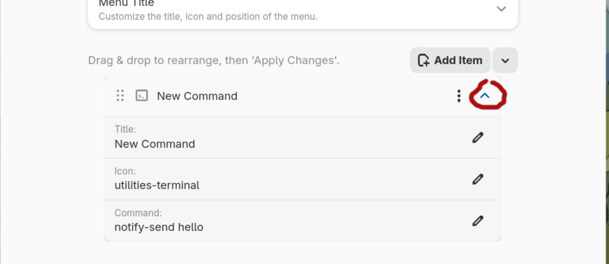
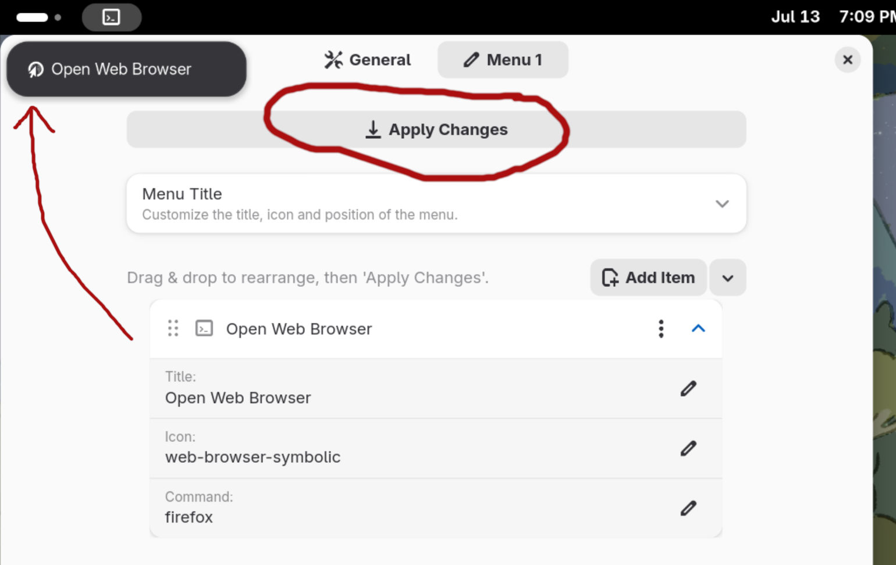

# GNOME Command Menu 2 Extension

A GNOME Shell extension to create highly-customizable menus in the top bar. Quickly access your apps, scripts, files and more.

[](https://extensions.gnome.org/extension/8490/command-menu-2/)

Start with one of our templates - or build your own menu!



This project is forked from [Command Menu by arunk140](https://github.com/arunk140/gnome-command-menu) and includes changes I made to keep it working in recent GNOME versions. It also includes a BUNCH of new features:
- Menu editor GUI
- Menu templates
- Multiple menus - create as many as you like!
- Labels
- Change menu position (left, center, or right)
- Change menu index (e.g., place a menu on left or right of Activities button)
- Submenu icons
- Icons can be loaded from a filepath
---

## Installation

### Install from GNOME Extensions website (recommended):
1. [](https://extensions.gnome.org/extension/8490/command-menu-2/)
2. Use [Extension Manager](https://flathub.org/apps/com.mattjakeman.ExtensionManager) to enable it and create your menus!

### Manual install
1. Install the extension:
    ```bash
    git clone https://github.com/goldentree1/gnome-command-menu-2
    cd gnome-command-menu-2
    bash install.sh 
    ```

    You will need to logout and login again so the extension is recognised!

2. Enable it:
    ```bash
    gnome-extensions enable command-menu2@goldentree1.github.com
    ```
    Or alternatively, use [Extension Manager](https://flathub.org/apps/com.mattjakeman.ExtensionManager) to enable it and access preferences.

## Usage & Configuration
This extension reads the configuration stored in [~/.commands.json](~/.commands.json) to generate your menus. You can use the preferences app to create and customize your menus - or manually edit the configuration yourself.

### Step-by-step configuration guide:
1. Open preferences for this extension, and click 'Edit' on the menu you want to configure:

2. Click 'Add Item' to add an item to the menu. You can also click the arrow button for more options (e.g., to add a label or a separator):

3. Click the arrow on the right side of the new menu item to see configuration options:



    - #### Title
        Give your menu item a custom title
    - #### Icon
        Icons can either be a system-icon name (e.g., "folder"), or a filepath to an icon (e.g., "~/Downloads/my-icon.jpg"). We have since added a basic 'Icons...' button to help you out, but also check out [this list of system icon names](https://github.com/StorageB/icons/blob/main/GNOME48Adwaita/icons.md) you can use!
    - #### Command
        The command that is run when the menu item is clicked on (e.g., the command 'firefox' will start the Firefox application). You should be able to find common commands like this on Google if you are inexperienced. Our templates also have some examples. You can [learn more about commands and scripting here](https://www.freecodecamp.org/news/bash-scripting-tutorial-linux-shell-script-and-command-line-for-beginners/).

5. Click 'Apply Changes' to see your changes!


## Contributions
I would love to hear about any bugs, suggested changes or feature ideas you may have! Please leave an issue or pull request on Github.
