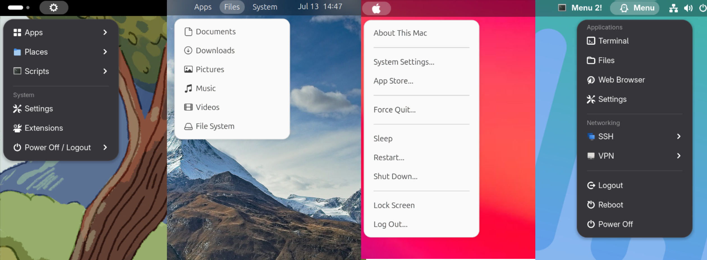

# GNOME Command Menu 2 Extension

A GNOME Shell extension to create highly-customizable menus in the top bar. Quickly access your apps, scripts, files and more.

Start with one of our templates - or build your own menu!



This project is forked from [Command Menu by arunk140](https://github.com/arunk140/gnome-command-menu) and includes changes I made to keep it working in recent GNOME versions. It also includes a BUNCH of new features:
- Menu editor GUI (a bit rough for now)
- Menu templates
- Multiple menus - create as many as you like!
- Change menu positions (left, center, or right)
- Change index (for example, you could place the menu on the left or right of the activities button)
- Submenus can have icons
- Icons can be loaded from a filepath
---

## Installation

This extension is not yet available on [GNOME Extensions](https://extensions.gnome.org/), but it can be manually installed:

1. Install the extension:
    ```bash
    git clone https://github.com/goldentree1/gnome-command-menu-2
    cd gnome-command-menu-2
    bash install.sh 
    ```

    You will need to logout and login again so the extension is recognised!

2. Enable it:
    ```bash
    gnome-extensions enable command-menu2@goldentree1.github.com
    ```
    Or alternatively, use [Extension Manager](https://flathub.org/apps/com.mattjakeman.ExtensionManager) to enable it.

3. Create your menu in preferences!
    ```bash
    gnome-extensions prefs command-menu2@goldentree1.github.com
    ```
     Or alternatively, use [Extension Manager](https://flathub.org/apps/com.mattjakeman.ExtensionManager) to open preferences.


## Usage & Configuration
This extension reads the configuration stored in [~/.commands.json](~/.commands.json) to generate your menus. You can use the preferences app to create your menus or manually edit the configuration yourself.

## Contribution
I would love to hear about any bugs, suggested changes or feature ideas you may have! Contributions are welcome! Please leave an issue or pull request on Github.
